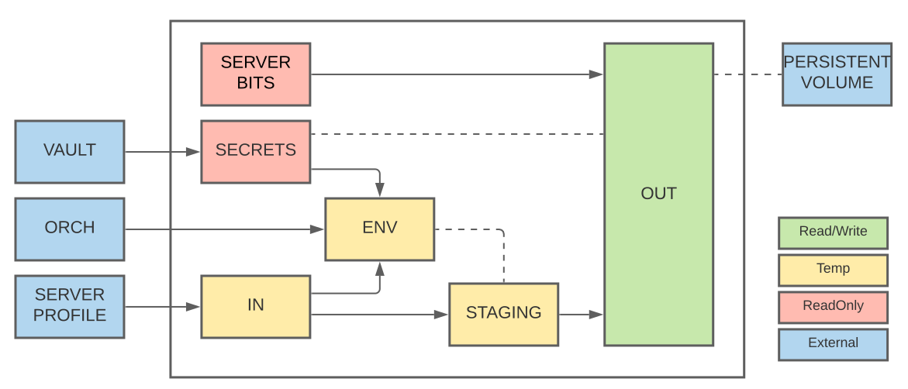
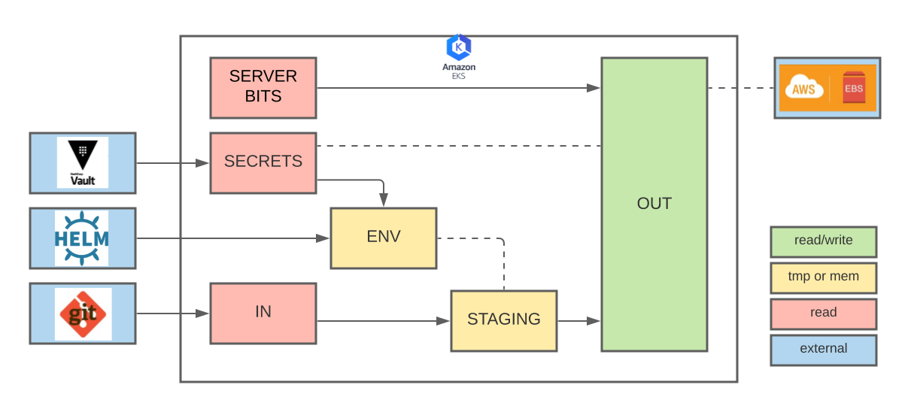
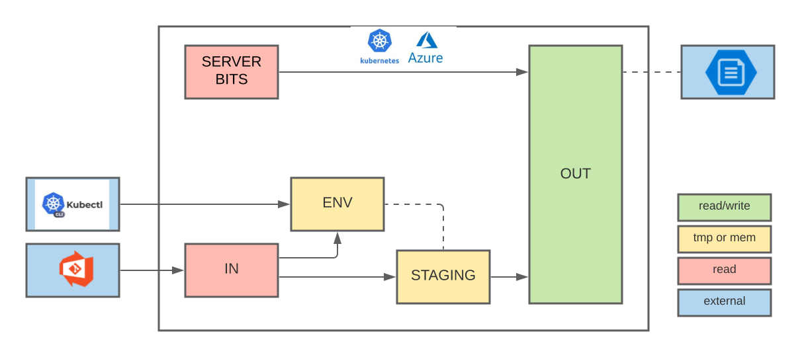

# Introduction

## Image/Container Anatomy

The diagram below shows the anatomy of a container with flows of data into the container and how it transitions to the eventual running state.

| Data Class        | Default Location  | Use | Description                                                                                                       |
| ----------------- | ----------------- | :-: | ----------------------------------------------------------------------------------------------------------------- |
| VAULT             |                   | ext | Secret information from external Vault (i.e. HashiCorp Vault).  Items like passwords, certificates, keys, etc...  |
| ORCH              |                   | ext | Environment variables from secrets, configmaps and/or env/envfile resources from orchestration (i.e. docker, k8s. |
| SERVER PROFILE    |                   | ext | Product server profile from either an external repository (i.e. git) or external volume (i.e. aws s3).            |
| SERVER BITS       | /opt/server       | ro  | Uncompressed copy of the product software.  Provided by image.                                                    |
| SECRETS           | /run/secrets      | ro  | Read Only secrets residing on non-persistent storage (i.e. /run/secrets).                                         |
| IN                | /opt/in           | ro  | Volume intended to receive all incoming server-profile information.                                               |
| ENV               | /opt/staging/.env | mem | Environment variable settings used by hooks and product to configure container.                                   |
| STAGING           | /opt/staging      | tmp | Temporary space used to prepare configuration and store variable settings before being moved to OUT               |
| OUT               | /opt/out          | rw  | Combo of product bits/configuration resulting in running container configuration.                                 |
| PERSISTENT VOLUME |                   | rw  | Persistent location of product bits/configuration in external storage (i.e. AWS EBS)                              |

Due to many factors of how an image is deployed:

* Deployment Environment - Kubernetes, Cloud Vendor, Local Docker
* CI/CD Tools - Kubectl, Helm, Kustomize,  Terraform
* Source Maintenance - Git, Cloud Vendor Volumes
* Customer Environment - Development, Test, QA, Stage, Prod
* Security - Test/QA/Production Data, Secrets, Certificates, Secret Management Tools

the options available and recommended for use of the elements above can vary greatly.

Examples might look like:

### Production Example

The diagram below shows an example in a high-level production scenario in an AWS EKS environment, where HashiCorp Vault is used to provide secrets to the container, Helm used to
create k8s resources and deploy them, and AWS EBS volumes to persist the state of the container.

### Development Example

The diagram below shows an example in a high-level development scenario in an Azure AKS environment, where no secrets management is used, simple kubectl is used to
deploy k8s resources, and AWS EBS volumes persist the state of the container.

## Customizing the Containers

You can customize our product containers by:

* [Customizing server profiles](../how-to/profiles.md)

    The server profiles supply configuration, data, and environment information to the product containers at startup. You can use our server profiles, or use them as a baseline for creating your own. You'll find these in [Baseline server profiles](https://github.com/pingidentity/pingidentity-server-profiles/tree/master/baseline) in our pingidentity-server-profiles repository.

* [Customizing YAML files](yamlFiles.md)

    In the stack-related directories for the deployment examples, you'll find the YAML files used to configure the Docker stack deployment. The YAML files can contain startup configuration settings or references to startup configuration settings (such as, environment variables) for the stack. You can try different configuration settings using these YAML files, or use them as a baseline for creating your own.

* [Using DevOps hooks](hooks.md)

    Hooks are DevOps shell scripts, generally specific to a product, that you can use to automate certain operations.
    You'll find the hooks for our builds in the [Docker builds product directories](../docker-builds/README.md).

* [Using release tags](releaseTags.md)

    We use sets of tags for each released build image. These tags identify whether the image is a specific stable release, the latest stable release, or current (potentially unstable) builds. You'll find the release tag information in [Docker images](releaseTags.md). You can try different tags in either the standalone startup scripts for the deployment examples, or the YAML files for the orchestrated deployment examples.

* [Securing the containers](../how-to/secureContainers.md)

    By default, our Docker images run as root within the container. Refer to this topic for instructions in changing this.

* [Adding a message of the day (MOTD)](addMOTD.md)

    You can use a `motd.json` file to add message of the day information that will be used by the DevOps images.